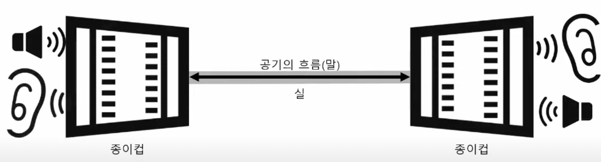
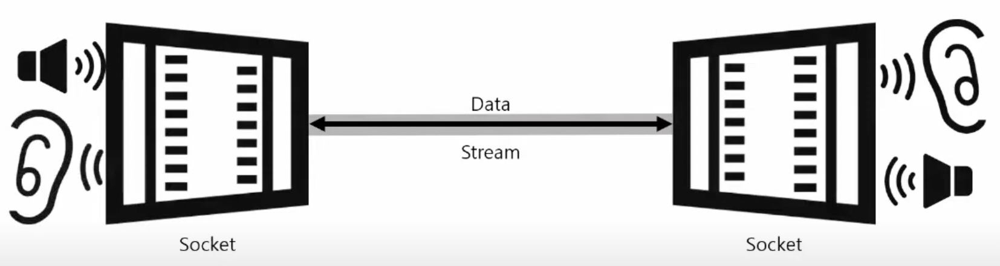

# TCP/IP 통신

## TCP와 UDP
### 전송 계층의 대표적인 프로토콜
- TCP : 연결 필요O. 전달 및 순서 보장O (전화와 비슷)
- UDP : 연결 필요X. 전달 및 순서 보장X (편지와 비슷)

## Socket
### Socket vs Socket API
- Socket : 프로세스 간 통신의 종착점. 서버에서의 end point, 클라이언트에서의 end point가 연결이 되는 것. 이 둘이 연결되어서 어떻게 통신을 하느냐를 프로그래밍할 때 Socket API를 쓰는 것.
- Socket API : Berkeley Socket이라고 많이 부른다.

## TCP 통신 및 Socket의 정의(참고 : https://www.youtube.com/watch?v=RjW6BeoHhHQ)
### TCP 통신이란?
- 실시간 통신을 의미한다.
- 주로 채팅 프로그램과 같이 실시간으로 소통이 되어야하는 프로그램에 많이 사용

### Socket이란?

위와 같이 종이컵 전화기를 비유하면 이해가 쉽다.

종이컵 전화기를 통해 상대가 말을 하면, 그 소리가 실을 타고 나의 종이컵으로 넘어온다.

여기서 종이컵 하나를 socket, 연결된 실을 Stream, 실을 통해서 오가는 말을 Data로 생각을 하면 된다.

## TCP 통신 순서
1. 서버에서 접속 요청을 받기 위한 소켓을 하나 준비한다.(Listen. 단지 접속 요청을 받는 용도만을 위한 소켓)
2. 클라이언트 측에서도 소켓을 만들어서, 서버에 접속 요청을 보낸다(Connect)
3. 서버는 접속 요청을 받아서, 앞서 만든 접속 요청을 받는 소켓이 아닌, "클라이언트와 통신할 소켓"을 따로 또 만든다(Accept)
4. 소켓을 통해 서로 데이터를 주고 받는다(Send & Receive를 반복)
5. 통신을 마치면 소켓을 닫는다.(Close. 클라이언트와 서버 둘 중 누구든지 Close를 할 수 있다. Close를 하면 상대방이 "아 얘가 끊었구나" 하고 알 수 있다.)