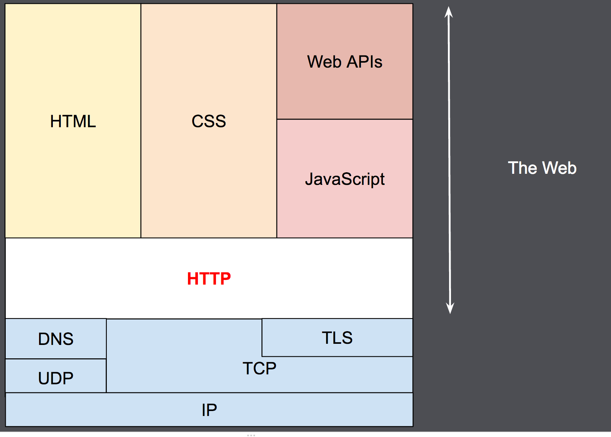
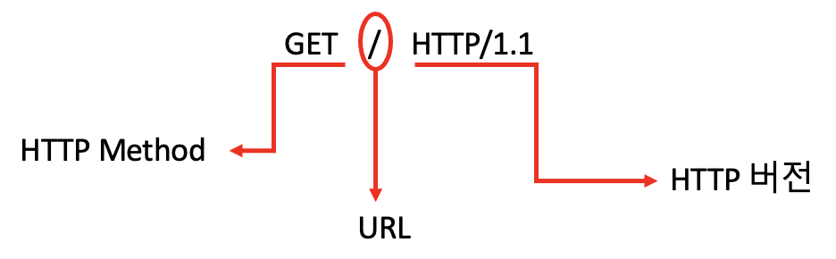

# HTTP의 이해(다시 듣기)

## HTTP
- HTTP : HyperText Transfer Protocol. HTML과 같은 하이퍼미디어 문서를 전송하기 위한 애플리케이션 레이어 프로토콜
- Protocol : 규약, 규칙의 집합
- 애플리케이션 레이어 : OSI 7계층 참고(https://ko.wikipedia.org/wiki/OSI_%EB%AA%A8%ED%98%95)
  - 2계층
    - 데이터 링크 계층. 
    - MAC Address 사용
  - 3계층 
    - 네트워크 계층. 
    - IP Address 사용. 
    - 서로 멀리 떨어져있는 애들끼리 인식할 수 있는 기술
  - 4계층 
    - 전송 계층. 
    - TCP, UDP를 사용. 
    - Port number
  - 7계층
    - 응용 계층
    - HTTP 등
    - HTTPS 와 같은 보안 프로토콜을 위한 TLS와 같은 보안 계층이 들어갈수 있다(?)
  
   
  - 웹을 공부한다고 하면, 위에 표시된 HTTP ~ HTML, CSS, JS, WebAPI를 공부한다고 보면 된다.
  - HTTP + TLS -> HTTPS

## 클라이언트-서버 모델 + 메시지 교환
- 서비스/리소스 -> URL(리소스를 특정함)
- 클라이언트 : 요청
- 서버 : 처리 -> 응답

## HTTP는 무상태 프로토콜
- 각각의 요청이 독립적 -> 따라서 클라이언트는 매 요청마다 본인이 누군지 밝혀야함
- 매번 본인을 밝히기 번거로우므로 다음 방법을 활용할 수 있다.
  - 쿠키
  - 세션(세션 ID를 대개 쿠키로 관리)
  - 웹 브라우저의 localStorage

## HTTP 메시지
- https://developer.mozilla.org/ko/docs/Web/HTTP/Messages
- 기본적으로는 사람이 읽을 수 있는 형태
- 요청과 응답 모두 동일한 구조
  - Start line 
  - Headers
  - 빈 줄(***중요!!!!!!!)
  - Body
    - 사람이 읽을 수 없는 바이너리 형태도 가능
    - 하나가 아니라 여럿일 수 있다.
    - 파일 업로드에 쓰이는 multipart/form-data가 대표적

## HTTP Method(요청)
- https://developer.mozilla.org/ko/docs/Web/HTTP/Methods
- HTTP 메시지 첫번째 줄에서 다음과 같은 형태로 사용
  

- GET : 요청한 데이터를 받기만 함
- HEAD : GET과 마찬가지로 데이터를 받기만 하지만, Body를 포함하지X
- POST : 특정 리소스에 제출(Submit, 멱등성X)
  - *멱등성 : 같은 작업을 여러번 해도 상태가 바뀌지X
  - ex. 회원가입 시, 다시 한번 더 회원가입 작업을 하려 하면 이를 막아야함 -> 멱등성 X
  - Create로 사용
- PUT : overwrite
  - ex. a=2, b=4, c=1 데이터에 PUT으로 b=2 요청 날림 -> overwrite 되어서 b=2만 남게 됨
- PATCH : 부분적 update(멱등성X)
  - ex. a=2, b=4, c=1 데이터에 PUT으로 b=2 요청 날림 -> a=2, b=2, c=1 로 update됨.
- DELETE : delete
- OPTION : 여러가지 지원하는 것 확인
  - POST 가능한지, Header 정보 확인 등등

## HTTP Status Code(응답)
- https://developer.mozilla.org/ko/docs/Web/HTTP/Status
- 1xx -> 정보 응답. 잘 사용하지X
- 2xx -> 성공 응답
  - 200 OK : 요청이 성공적으로 응답됨
  - 201 Created : 성공적 응답 & 그 결과 새로운 리소스 생성됨
  - 204 No Content : 성공적 응답 but 보여줄 body X
- 3xx : 리다이렉션 메시지
  - 304 Not Modified : 응답이 수정되지 않았음을 알려줌
- 4xx : 클라이언트 문제
  - 404 Not Found
- 5xx : 서버 쪽 문제
  - 500 Internal Server Error