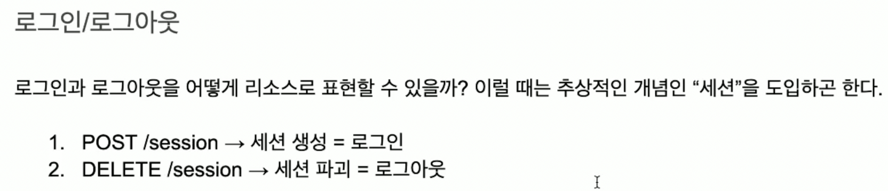

# Collection Pattern 적용

## CRUD
- 데이터에 대해 취하는 모든 기능은 다음 4개로 정리 가능
  1. Create
  2. Read
  3. Update
  4. Delete

## CQS
- CRUD의 중요한 특징에 따라 Command, Query 둘로 나눌 수 있다.
    1. Command : Create, Update, Delete - 상태가 변함 -> 안전X
    2. Query : Read - 상태가 변하지X -> 안전O -> 분산, 캐시 등이 수월

## HTTP Method
- Collection Pattern과 HTTP Method를 이용해 CRUD를 표현할 수 X
    1. GET -> Read
    2. POST -> Create
    3. PUT, PATCH -> Update
    4. DELETE -> Delete

