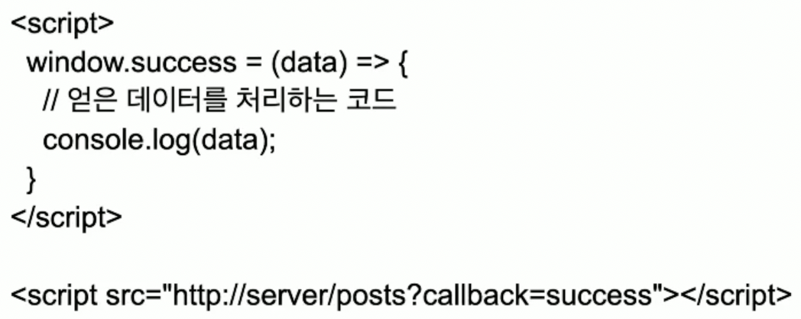
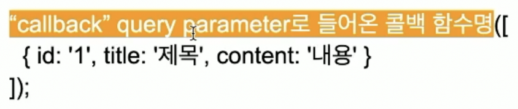

# CORS

## Same-Origin Policy
- B/E(리소스의 출처)와 F/E(현재 페이지)의 호스트(및 포트)가 다른 경우에 접근할 수 없도록 막는 보안 정책
- 두 URL의 프로토콜, 포트, 호스트가 모두 같은 경우 동일한 출처라 한다.
- 요청 메시지<br>
GET /posts HTTP/1.1<br>
Host : http://localhost:8080 -> B/E(Rest API)
Origin : http://localhost:3000 -> F/E

## JSONP
- 과거에 주로 사용된 방법
- \<script\> 태그는 동일 출처 여부를 따지지 않음
- 서버에서 JSON을 직접 전달X. 실행되는 자바스크립트 코드를 전달하는 방식.
- 
- 
- 즉 위에 사진의 경우에는<br>
```
success ([
    {id: '1', title: '제목', content: '내용'}
]);
```

## CORS(Cross-Origin Resource Sharing)
- 서로 다른 origin에서 리소스를 공유하는 것
- Backend, 즉 REST API 응답 헤더에 "Access-Control-Allow-Origin"을 포함시키면 됨.
<br>-> 서버 쪽에서 "여기서 요청한건 괜찮아요" 라고 말해주는 것
- 웹페이지(F/E) : https://yoolim.com<br>
API 서버(B/E) : https://api.yoolim.com<br>
<br>
```
응답 메시지

HTTP/1.1 200 OK
Access-Control-Allow-Origin : https://yoolim.com
(빈 줄)
[
    {
        "id" : "123",
        "title" : "제목",
        ...
    }
]
```

## Spring Web MVC에서 CORS
1. HttpServletResponse
```java
@GetMapping
public List<PostDto> list(
    HttpServletResponse response
) {
    response.addHeader("Access-Control-Allow-Origin", "http://localhost:3000");

    // origin과 무관하게 모든 요청에 대해 허용할 때
    // response.addHeader("Access-Control-Allow-Origin", "*");
    
    List<PostDto> postDtos = List.of(
            new PostDto("1", "first title", "first content"),
            new PostDto("2", "2등", "2등이다!!")
    );

    return postDtos;
}
```
2. @CrossOrigin
```java
@CrossOrigin("https://localhost:3000")
@GetMapping
public List<PostDto> list(){
    // blah blah
}
```
다음과 같이 Controller 위에 어노테이션을 놓으면 컨트롤러 안에 있는 모든 메소드들에 @CrossOrigin이 적용된다.
```java
@CrossOrigin("https://localhost:3000")
@RequestMapping("/posts")
@RestController
public class PostController {
    // blah blah
}
```
3. dd