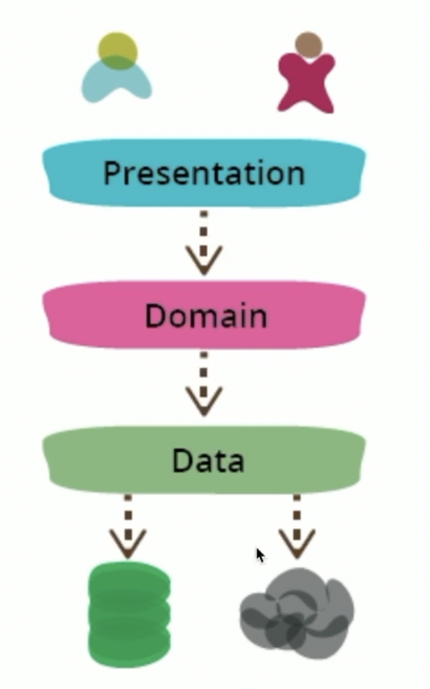
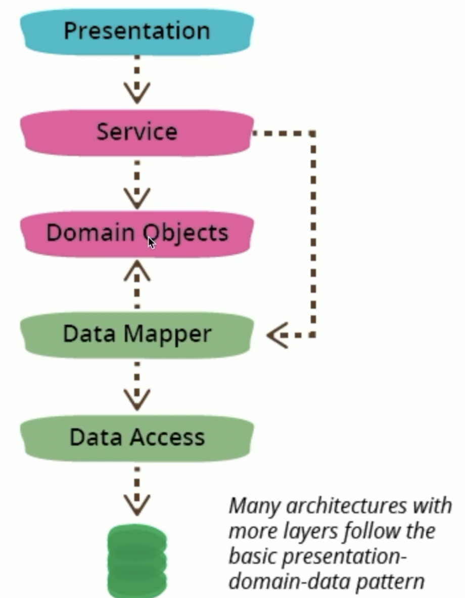

# Data Access

## Layered Architecture
- 전통적인 3계층
  - https://martinfowler.com/bliki/PresentationDomainDataLayering.html
  - 
  - Presentation : UI Layer
  - Domain : 문제 영역(Service?)
  - Data
  - 

## DAO
- Data에 access하는 Object