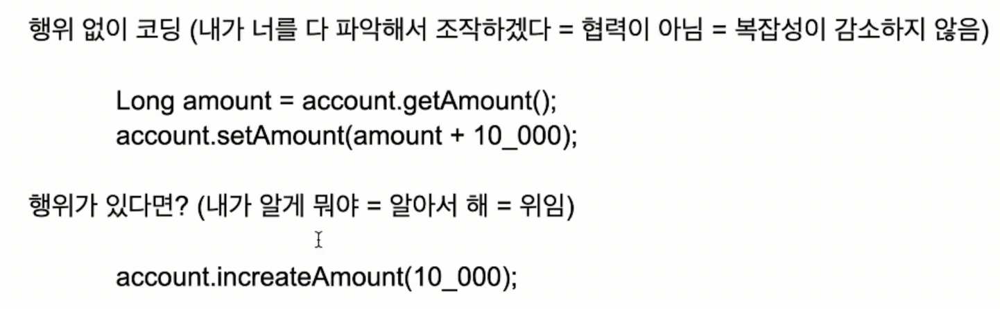

# Domain Model

https://wikibook.co.kr/article/layered-architecture/

https://martinfowler.com/eaaCatalog/repository.html

풍성한 도메인 모델을 만들어도 되고 안 만들어도 됨
풍성한 도메인 모델을 만들게 되면 유지 보수는 편하지만, 코드량이 늘어남

Anemic & Rich - "풍성한 도메인 모델을 지향하지만, 당장에는 무기력하게 만들고, 점차점차 전환하자"

** Getter는 절대 비즈니스 로직을 위해 쓰지 않는다.(https://velog.io/@kmw89891/Getter%EB%A5%BC-%EC%A7%80%EC%96%91%ED%95%98%EC%9E%90)
ex.
Long amount = account.getAmount();
account.setAmount(amount + 10_000);
이렇게 X